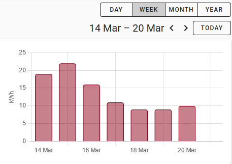

# homeassistant_gazpar_cl_sensor

## Objectif

L'objectif est de récupérer la consommation journalière de gaz (en kWh et en m<sup>3</sup>) et de la représenter sous forme d'un diagramme à barres dans Home Assistant, chaque barre correspondant à la consommation de la veille. La consommation peut également être intégrée dans le Tableau de bord Energie de Home Assistant.




## Principe de fonctionnement

L'intégration dans Home Assistant nécessitera un peu de patience et nous fera visiter quelques aspects de ce système.

La consommation est représentée sous forme d'un *Command line sensor* dont la mise à jour est provoquée par une *Automatisation*. Ainsi nous maîtrisons le moment et la fréquence de connexion à l'espace client GRDF, et nous évitons de l'interroger inutilement à propos de la consommation, sachant qu'elle n'est disponible qu'à partir de l'après-midi, ou même encore plus tard. En tout cas, il en est ainsi pour la mienne.

La récupération de la consommation se déroule de la manière suivante:

- Dans l'après-midi, la commande *gazpar_ha.sh fetch* effectuera une connexion à l'espace client GRDF et enregistre la consommation dans le fichier *releve_du_jour.json*.

- Ensuite, la commande *gazpar_ha.sh sensor* va extraire les détails de la consommation de ce fichier. C'est cette commande qui alimente le *Command line sensor* et qui lui fournit la consommation journalière et l'index du compteur.

- Un peu avant minuit, nous effaçons les consommations journalières de ce fichier, et remettons les *Sensors* de la consommation journalière à la valeur "inconnu" (-1).

Ainsi, chaque jour, nos *Sensors* de la consommation journalière aura cette valeur jusqu'à la récupération du nouveau relevé, qu'il conservera jusqu'à peu avant minuit.

## Installation

Créer un dossier *gazpar* dans le dossier *config* de Home Assistant (là, où se trouve le fichier *configuration.yaml*).

NB: ce dossier est à la fois accessible de l'intérieur du conteneur Home Assistant, et depuis la machine hôte. Il est ainsi possible d'y accéder par *scp* ou par *Samba* pour y copier des fichiers. 

Placez-vous dans ce dossier, et commencez à télécharger le premier fichier:

```
wget https://raw.githubusercontent.com/frtz13/homeassistant_gazpar_cl_sensor/master/gazpar.py
```

Faites de même avec:

- gazpar_ha.py

- gazpar_ha.sh

- requirements.txt

Rendez gazpar_ha.sh exécutable:

```
chmod +x gazpar_ha.sh
```

NB: selon votre contexte de travail, il est possible qu'il soit nécessaire de faire précéder certaines commandes par "sudo".

## Mise à jour

Si vous utilisez déjà une version précédente du gazpar_cl_sensor:

- Remplacez les fichiers qui ont été modifiés.

- Passez le reste de cet article en revue et complétez et modiez les définitions des Sensors etc. dans Home Assistant.

- Vous pouvez supprimer les fichiers devenus inutiles: gazpar_ha.cfg, conso_par_jour.json, conso_par_mois.json.

## Paramétrer l'accès à l'espace client GRDF

Tout d'abord, il faudra créer un espace client chez GRDF, si cela n'est pas déjà fait, et s'y rendre, afin d'accepter les CGV.

Si vous n'avez pas encore installé un éditeur pour modifier des fichiers de configuration de Home Asssitant, c'est le moment. A partir du Add-on Store du Superviseur de Home Assistant, installez "File editor" ou "Visual Studio Code".

Inscrivez votre nom utilisateur, mot de passe et votre PCE (vous le trouvez par ex. dans votre facture de gaz) dans secrets.yaml:

    grdf_user: "votre@adresse.email"
    grdf_pwd: "password"
    grdf_pce: "votre_pce"

## Intégration dans Home Assistant

### Définition du *Command Line Sensor*, *Shell commands* etc.

Dans *configuration.yaml*, ajouter:

```
sensor:
  - platform: command_line
    name: GRDF consommation gaz
    command: "/config/gazpar/gazpar_ha.sh sensor"
    scan_interval: 100000000
    unit_of_measurement: "kWh"
    json_attributes:
      - conso_m3
      - index_kWh
      - index_m3
      - date
      - log
    value_template: '{{ value_json.conso }}'

# un de ces Sensors permettra d'ajouter la consommation au Tableau de bord Energie 
template:
- sensor:
    name: "Gas consumption index (m³)"
    unit_of_measurement: "m³"
    device_class: "gas"
    state_class: "total_increasing"
    state: "{{ state_attr('sensor.grdf_consommation_gaz', 'index_m3') }}"

- sensor:
    name: "Gas consumption index (kWh)"
    unit_of_measurement: "kWh"
    device_class: "energy"
    state_class: "total_increasing"
    state: "{{ state_attr('sensor.grdf_consommation_gaz', 'index_kWh') }}"

# ce Sensor est optionnel
  - sensor:
    name: "GRDF consommation gaz (m³)"
    unit_of_measurement: "m³"
    device_class: "gas"
    state: "{{ state_attr('sensor.grdf_consommation_gaz', 'conso_m3') }}"

shell_command:
    grdf_get_data: '/config/gazpar/gazpar_ha.sh fetch  {{ states("input_text.grdf_user") | base64_encode }} {{ states("input_text.grdf_pwd") | base64_encode }}  {{ states("input_text.grdf_pce") }}'
    grdf_delete_data: '/config/gazpar/gazpar_ha.sh delete'

input_text:
  grdf_user:
    initial: !secret grdf_user
  grdf_pwd:
    initial: !secret grdf_pwd
  grdf_pce:
    initial: !secret grdf_pce
```

NB: si *configuration.yaml* contient déjà une rubrique "sensor:", ne créez pas une nouvelle rubrique de ce nom, mais ajoutez les définitions "sensor" à la rubrique existante. Idem pour les rubriques *template*, *shell_command* ou *input_text*.

L'attribut *date* du *Sensor GRDF consommation gaz* correspond à la *Journée gazière*  du relevé. Cette date correspond à la veille du relevé du compteur, qui est effectuée tôt le matin. Au moment où j'écris ces lignes, je récupère les relevés avec deux jours de retard.

Vous trouverez le PCE de votre installation dans votre facture de gaz, ou dans votre espace client GRDF.

Ensuite, menu Configuration / Contrôle du serveur:  vérifier la configuration (très important de le faire chaque fois!), et si tout est ok, redémarrer Home Assistant. Veuillez noter qu'il va falloir faire ceci aussi pour qu'une modification des infos dans *secrets.yaml* soit prise en compte.

Vous pouvez ajouter le sensor *Gas consumption index (m<sup>3</sup>)* ou *Gas consumption index (kWh)* au Tableau de bord Energie de Home Assistant. 

### Essais

Dans Home Assistant, rendez-vous dans Outils de développement / SERVICES, sélectionner le service *shell_command.grdf_delete_data* puis appuyez sur "Call SERVICE". Cela installera d'éventuelles bibliothèques PYTHON manquantes, et devrait créer les fichiers *releve_du_jour.json*, *activity.log*, *pip.log* et *piperror.log* dans le dossier *gazpar*.

Si aucun nouveau fichier n'est présent: vérifiez qu'il n'y a pas d'erreur au niveau du nom du dossier (écriture en majuscules/minuscules compte!), et consultez le log de Home Assistant.

Ensuite, faites de même avec le service *shell_command.grdf_get_data*. Examinez à nouveau le contenu de votre dossier *gazpar*.

Si tout va bien, les fichiers *releve_du_jour.json* et *activity.log* ont évolués. Je vous invite de consulter le contenu de ces fichiers.

Si vous avez obtenu le fichier *activity.log* mais pas de fichier *json*: consultez-le; il y a peut-être un problème avec les identifiants pour accéder à l'espace client GRDF, ou que l'accès à l'espace n'a pas permis de récupérer des données de consommation (dans ce cas, on trouve la mention "No data received" dans le log). Dans ce cas, exécutez le service une nouvelle fois dans Home Assistant.

Lançons maintenant la mise à jour de notre *sensor*: rendez-vous dans Outils de développement / SERVICES, sélectionnez le service *homeassistant.update_entity* puis l'Entité *sensor.grdf_consommation_gaz*, puis appuyez sur "Call SERVICE". Puis regardez dans Outils de développement / ETATS, si votre Entité *sensor.grdf_consommation_gaz* a bien été mise à jour avec la consommation de la veille. Si elle porte la valeur -1, cela signifie que la consommation de la veille n'est pas encore disponible (vérifiez!).

### Automatisation de la lecture de la consommation de la veille

Pour rendre la connexion à l'espace client automatique, nous ajoutons une *Automatisation* dans Home Assistant (Configuration / Automatisations).

Commencer par une Automatisation vide:

- Nom: *GRDF get data*, Mode: Unique

- Déclencheur: type: Modèle de temps, Heures: 18, Minutes: /10, Secondes: 0
  ce qui signifie: entre 18 et 19 heures, déclencher cette *Automatisation* toutes les 10 minutes.

- Conditions: type: Valeur numérique, Entité: sensor.grdf_consommation_gaz, en dessous de: -0.5

- Puis trois Actions:
  
  - type *Appeler un service*: shell_command.grdf_get_data
  
  - type: *Délai*, valeur: 00:01:00
  
  - type: *Appeler un service*, service: *homeassistant.update_entity*: *sensor.grdf_consommation_gaz*.

Quelques remarques:

- Vous pouvez par la suite ajouter à cette Automation d'autres Déclencheurs de type *Time* ou *Time Pattern*.

- Grâce à la "condition", cette Automation ne se déclenchera plus dès que nous aurons obtenu la consommation de la veille.

- Le délai dans les Actions laissera un peu de temps à l'Action précédente de se terminer, même si Home Assistant perd la patience au bout d'une minute.

Une chose est encore à faire: peu avant minuit, la valeur du *sensor* doit être remis à l'état *inconnu*. Donc, une autre Automatisation:

- Nom: *GRDF reset*, Mode: Unique

- Déclencheur: type *Heure*, à: 23:56

- Actions:
  
  - type *Appeler un service*, *shell_command.grdf_delete_data*
  
  - type: Délai, valeur: 00:01:00
  
  - type *Appeler un service*, service: *homeassistant.update_entity:* *sensor.grdf_consommation_gaz*.

### Le graphique

Pour la présentation, nous utiliserons la "ApexCharts Card" ([[GitHub - RomRider/apexcharts-card:  A Lovelace card to display advanced graphs and charts based on ApexChartsJS for Home Assistant](https://github.com/RomRider/apexcharts-card)]).

Son installation se résume grosso-modo à:

- télécharger *apexcharts-card.js* et le placer dans le dossier /config/www

- dans Home Assistant, se rendre dans Configuration / Tableaux de bord Lovelace, onglet Ressources. Click sur "+" puis saisir la URL "/local/apexcharts-card.js" et préciser le type *Javascript module*.

Enfin, dans votre tableau de bord, ajoutez y une carte de type *Personnalisé: ApexCharts Card*, Dans la configuration de la carte, copiez/collez te texte suivant:

```
type: 'custom:apexcharts-card'
graph_span: 12d
span:
  end: day
header:
  show: true
  title: Consommation gaz (kWh)
  show_states: false
  standard_format: true
yaxis:
  - min: 0
    decimals: 0
    apex_config:
      forceNiceScale: true
series:
  - entity: sensor.grdf_consommation_gaz
    type: column
    offset: +1day
    float_precision: 0
    show:
      name_in_header: false
    group_by:
      func: max
      duration: 1d
```

### Encore quelques remarques "en vrac":

Par rapport aux versions précédentes de ce command_line_sensor, la nature des données récupérées a changé avec la modification de l'espace client GRDF fin novembre 2021. Les consommations mensuelles ont disparu, et la valeur que nous pouvons intégrer dans le tableau de bord Energie est l'index du compteur (en m<sup>3</sup>), ou un compteur correspondant aux cumul de l'énergie consommée (en kWh) indiqué par GRDF dans les relevés journalières.

Dans le tableau de bord Energie de Home Assistant, la consommation de gaz au jour le jour aura un décalage d'un jour (contrairement au graphique apexcharts-card auquel nous avons pu imposer un décalage d'un jour afin de le caler correctement). Encore, ce décalage est devenu plus grand depuis la mise à jour de l'espace client GRDF.

--

Un grand merci à [Emmanuel](https://github.com/empierre), [Fabien](https://github.com/beufanet) et [Cyprien](https://github.com/cyprieng) pour l'élaboration du script d'accès à l'espace client GRDF.
