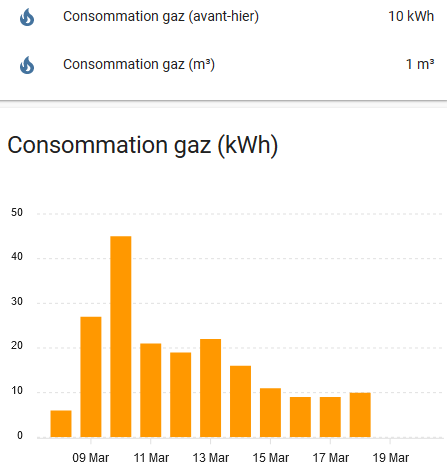

# homeassistant_gazpar_cl_sensor

## Objectif

L'objectif est de récupérer la consommation journalière de gaz et de le représenter sous forme d'un diagramme à barres d'un *sensor* dans Home Assistant, chaque barre correspondant à la consommation de la veille.



## Principe de fonctionnement

L'intégration dans Home Assistant nécessitera un peu de patience et nous fera visiter quelques aspects de ce système.

Techniquement parlé, elle fonctionne sans installation de modules supplémentaires, notamment à l'intérieur du conteneur Docker de Home Assistant.

La consommation est représentée sous forme d'un *Command line sensor* dont la mise à jour est provoquée par une *Automatisation*. Ainsi nous maîtrisons le moment de connexion à l'espace client GRDF, et nous évitons de l'interroger inutilement à propos de la consommation de la veille, sachant qu'elle n'est disponible qu'à partir de l'après-midi, ou même encore plus tard. En tout cas, il en est ainsi pour la mienne.

La récupération de la consommation se déroule de la manière suivante:

- Dans l'après-midi, la commande *gazpar_ha.sh fetch* effectuera une connexion à l'espace client GRDF et enregistre les consommations journalières des jours passés dans le fichier *export_days_values.json*.

- Ensuite la commande *gazpar_ha.sh sensor* va extraire la consommation de la veille de ce fichier. C'est cette commande qui alimente le *Command line sensor* et qui lui fournit la consommation de la veille.

- Un peu avant minuit, une *Automatisation* remet le *Sensor* à zéro, et nous effaçons le fichier des consommations enregistrés.

Ainsi, chaque jour, notre *Sensor* aura la valeur zéro jusqu'à la récupération de la consommation de veille, valeur qui conservera jusqu'à peu avant minuit.

Nous contournons une difficulté: l'interrogation de l'espace client GRDF dure souvent plus longtemps que 10 secondes. Or, Home Assistant abandonne l'attente au bout de 10 secondes, et rate ainsi le résultat. 

## Installation

Créer un dossier *gazpar* dans le dossier *config* de Home Assistant (là, où se trouve le fichier de configuration *configuration.yaml*).

NB: ce dossier est à la fois accessible de l'intérieur du conteneur Home Assistant, et depuis la machine hôte. Il est ainsi possible d'y accéder par *scp* ou par *Samba* pour y copier des fichiers, si vous avez installé cette extension. 

Placez-vous dans ce dossier, et commencez à télécharger le premier fichier:

```
wget https://raw.githubusercontent.com/frtz13/homeassistant_gazpar_cl_sensor/master/gazpar.py
```

Faites de même avec:

- gazpar_ha.py

- gazpar_ha.sh

- requirements.txt

- gazpar_model.cfg

Rendre gazpar_ha.sh exécutable:

```
chmod +x gazpar_ha.sh
```

NB: selon votre contexte de travail, il est possible qu'il soit nécessaire de faire précéder certaines commandes par "sudo".

## Paramétrer l'accès à l'espace client GRDF

Tout d'abord, il faudra créer un espace client chez GRDF, si cela n'est pas déjà fait, et s'y rendre, afin d'accepter les CGV.

Faire une copie de *gazpar_modele.cfg* et la nommer *gazpar.cfg*. Ensuite éditer ce nouveau fichier (avec nano, ou avec un éditeur dans Home Assistant, cf. ci-dessous) et paramétrer:

    GAZPAR_USERNAME="votre@adresse.email"
    GAZPAR_PASSWORD="password"

## Intégration dans Home Assistant

### Définition du *Command Line Sensor* et des *Shell commands*

Si vous n'avez pas encore installé un éditeur pour modifier le fichier *configuration.yaml* de Home Asssitant, c'est le moment. A partir du Add-on Store du Superviseur de Home Assistant, installez "File editor" ou "Visual Studio Code".

Dans *configuration.yaml*, ajouter:

```
sensor:
  - platform: command_line
    name: GRDF consommation gaz
    command: "/config/gazpar/gazpar_ha.sh sensor"
    scan_interval: 100000000
    unit_of_measurement: "kWh"
    json_attributes:
    - log
    value_template: '{{ value_json.conso | round(0) }}'
```

```
shell_command:
    grdf_get_data: '/config/gazpar/gazpar_ha.sh fetch'
    grdf_delete_data: '/config/gazpar/gazpar_ha.sh delete'
```

NB: si *configuration.yaml* contient déjà une rubrique "sensor:", ne créez pas une nouvelle rubrique de ce nom, mais ajoutez la définition du "sensor" à la rubrique existante. Idem pour la partie *shell_command*.

Ensuite, menu Configuration / Contrôle du serveur:  vérifier la configuration (très important de le faire chaque fois!), et si tout es ok, redémarrer Home Assistant.

### Essais

Dans Home Assistant, rendez-vous dans Outils de développement / SERVICES, sélectionner le service *shell_command.grdf_delete_data* puis appuyez sur "Call SERVICE". Cela installera d'éventuels bibliothèques manquantes.

Ensuite, faites de même avec le service *shell_command.grdf_get_data*.Retournez à la ligne de commande et examinez le contenu de votre dossier *gazpar*.

Si tout va bien, s'y trouvent des nouveaux fichiers: *gaspar_ha.log*, *export_days_values.json* et *export_days_values.log*. Vous pouvez consulter votre consommation des jours passés par la commande *cat export_days_values.json*.

Si aucun nouveau fichier n'est présent: vérifiez qu'il n'y a pas d'erreur au niveau du nom du dossier (écriture en majuscules/minuscules compte!).

Si vous avez obtenu les fichiers *log* mais pas le fichier *json*: lisez le log (cat gaspar.log); peut-être un problème avec les identifiants pour accéder à l'espace client GRDF, ou que l'accès à l'espace n'a pas permis de récupérer des données de consommation (dans ce cas, on trouve la mention "No results in data" dans le log). Dans ce cas, exécutez le SERVICE une nouvelle fois dans Home Assistant.

Lançons maintenant la mise à jour de notre *sensor*: rendez-vous dans Outils de développement / SERVICES, sélectionnez le service *homeassistant.update_entity* puis l'Entité *sensor.grdf_consommation_gaz*, puis appuyez sur "Call SERVICE". Puis regardez dans Outils de développement / ETATS, si votre Entité *sensor.grdf_consommation_gaz* a bien été mis à jour avec la consommation de la veille. Si elle porte la valeur -1, cela signifie que la consommation de la veille n'est pas encore disponible (vérifiez!). La valeur -2 signifie que le fichier *export_days_values.json* n'a pas été trouvé.

### Automatisation de la lecture de la consommation de la veille

Pour rendre la connexion à l'espace client automatique, nous ajoutons une *Automatisation* dans Home Assistant (Configuration / Automatisations, Commencer par une Automatisation vide):

- Nom: *GRDF get data*, Mode: Unique

- Déclencheur: type: Modèle de temps, Heures: 18, Minutes: /10, Secondes: 0
  ce qui signifie: entre 18 et 19 heures, déclencher cette *Automatisation* toutes les 10 minutes.

- Conditions: type: Valeur numérique, Entité: sensor.grdf_consommation_gaz, en dessous de: -0.1

- Actions:
  
  - type *Appeler un service*: shell_command.grdf_get_data
  
  - type: *Délai*, valeur: 00:02:00
  
  - type: *Appeler un service*, service: *homeassistant.update_entity*: *sensor.grdf_consommation_gaz*.

Quelques remarques:

- Vous pouvez par la suite ajouter à cette Automation d'autres Triggers de type Time ou Time Pattern.

- Grâce à la "condition", cette Automation ne se déclenchera plus dès que nous aurons obtenu la consommation de la veille.

- Le délai dans les Actions laissera un peu de temps à l'action précédente de se terminer, même si Home Assistant perd la patience au bout de 10s.

- Ne vous laissez pas intimider par le fait que la liste de sélection de l'Entité pour le Service homeassistant.update_entity soit vide. Tapez son nom en toutes lettres.

Une chose est encore à faire: peu avant minuit, la valeur du *sensor* doit être remis à zéro. Donc, une autre Automatisation:

- Nom: *GRDF reset*, Mode: Unique

- Déclencheur: type *Heure*, à: 23:58

- Actions:
  
  - type *Appeler un service*, *shell_command.grdf_delete_data*
  
  - type *Appeler un service*, service: *homeassistant.update_entity:* *sensor.grdf_consommation_gaz*.

### Le graphique

Pour la présentation, nous utiliserons la "Mini graph card" ([GitHub - kalkih/mini-graph-card: Minimalistic graph card for Home Assistant Lovelace UI](https://github.com/kalkih/mini-graph-card)).

Son installation se résume grosso-modo à:

- télécharger *mini-graph-card-bundle.js* et le placer dans le dossier /config/www

- dans Home Assistant, se rendre dans Configuration / Tableaux de bord Lovelace, onglet Ressources. Click sur "+" puis saisir la URL "/local/mini-graph-card-bundle.js" et préciser le type *Javascript module*.

Enfin, dans votre tableau de bord, ajoutez y une carte de type *Personnalisé: Mini Graph card*, Dans la configuration de la carte, copiez/collez te texte suivant:

```
type: 'custom:mini-graph-card'
name: Consommation gaz (par jour)
entities:
  - sensor.grdf_consommation_gaz
hours_to_show: 240
aggregate_func: max
group_by: date
icon: 'mdi:fire'
labels: true
hour24: true
show:
  graph: bar
```

Ne cherchez pas le configurateur graphique pour ce graphique... actuellement, il n'y en a pas.

--

Un grand merci à [Emmanuel](https://github.com/empierre) pour son travail de développement qui a été le point de départ pour ce projet.
